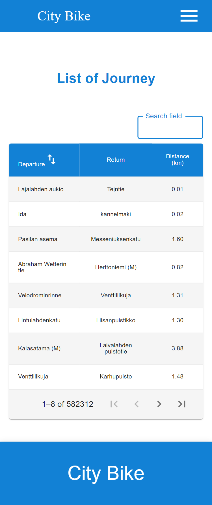
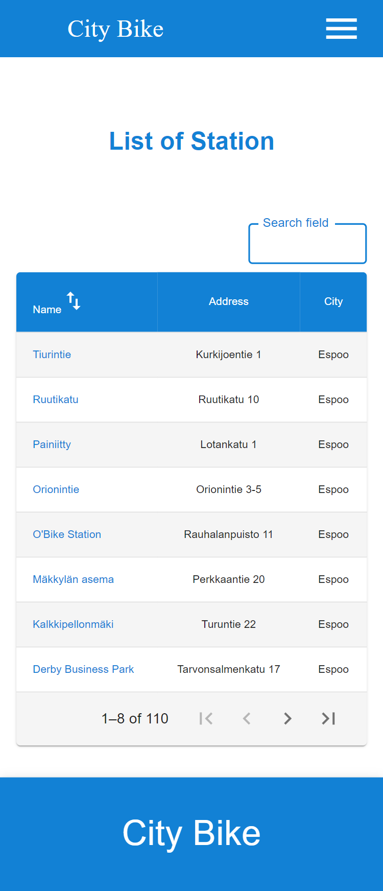
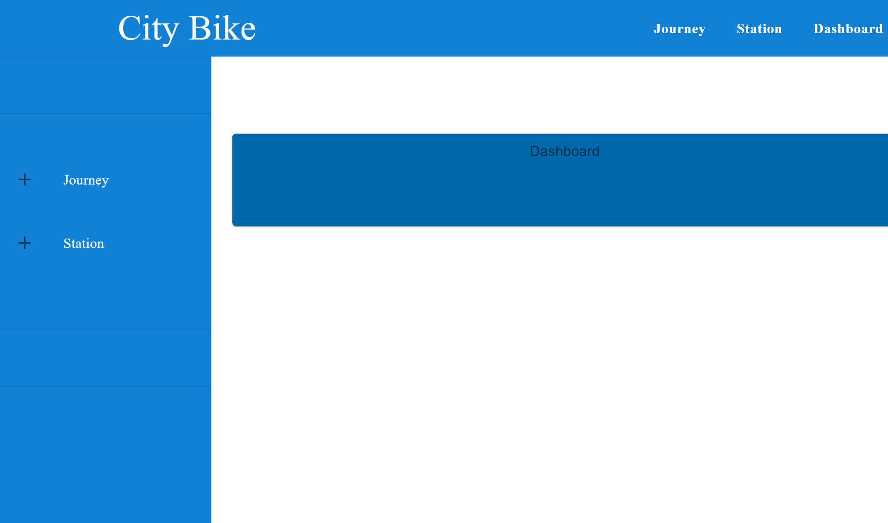
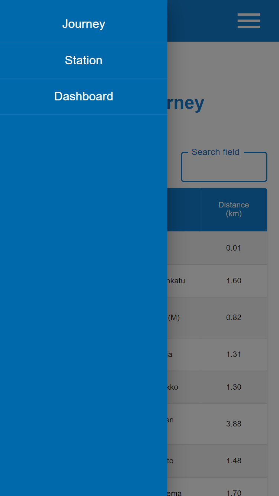

# City Bike Helsinki


- Frontend: Material Ui, TypeScript, React, Redux Toolkit
- Backend: ASP.NET Core, Entity Framework Core, PostgreSQL
- Devops: Docker, Github Actions, Azure Cloud, Netlify

> This stack provides a powerful and efficient solution for building a scalable system that can handle large datasets.
> ASP.NET Core is a cross-platform, open-source framework with a vast array of built in libraries.
> I have selected PostgreSQL for its stability and performance.

</br>

City Bike Helsinki is the pre-assignment for Solita Dev Academy Finland 2023. A convenient and eco-friendly bike service that allows residents and visitors of Helsinki to easily navigate the city on two wheels. The website listed all the stations and journeys of Helsinki region. You can create journey and station, search for a station and navigate through this website.

## Table of Content

- [Live Demo](#Live-Demo)
- [Features](#Features)
- [Prerequisites](#Prerequisites)
- [Configuration](#Configuration)
- [ToDo](#ToDo)
- [How to run the project](#How-to-run-the-project)
- [Result](#Result)
- [Endpoint](#Endpoint)

## Live Demo

https://citybikehelsinki.netlify.app

## Features

- List of Journeys
- List of Stations
- Station Details
- Dashboard
- Create Journey
- Create Station
- Searching, Pagination, Order by Column

## Prerequisites

- Node v16
- .NET 6.0

## Configuration

- `git clone https://github.com/Sumon-fa/City-Bike-Helsinki.git`
- Create a `.env ` file in root directory

  ```
   USER_ID=<Your Postgresql User Name>
   PASSWORD=<Your Postgresql Password>
  ```

- Create a `.env` file in frontend directory

  ```
   REACT_APP_BASE_URL=`<Your backend localhost address>`
  ```

- Manage user secrets

  - run `dotnet user-secrets init` in backend directory
  - run `dotnet user-secrets set "ConnectionStrings:DefaultConnection" "Host=localhost;Username=<Your postgres user name>;Password=<Your postgres password>;Database=<Your Db name>"`
  - run `dotnet user-secrets set "Host" "<Your frontend localhost address>"`

- To list the user secrets

  - run `dotnet user-secrets list`

- To update database
  - install `dotnet tool install --global dotnet-ef`

## How to run the project

#### Backend

- run `dotnet restore` in backend backend directory
- run `dotnet ef database update`
- run `dotnet run`

#### Frontend

- run `npm install` in frontend directory
- run `npm start`

### Docker

- run `docker-compose up`

## Import Journey from csv file

If there is permission issue, you can set permission clicking properties of the file or alternatively, you can use \ before Copy.
\Copy is little bit slower than Copy.

```
COPY journeys (departure, return, departure_station_id, departure_station_name, return_station_id, return_station_name, covered_distance, duration) FROM '/path/to/.csv' WITH (FORMAT csv, ENCODING 'UTF8', HEADER true) WHERE duration >= 10 AND covered_distance >= 10;
```

## Delete Duplicate Journey and Keep One record

```
DELETE FROM journeys WHERE ctid IN (
SELECT ctid FROM (
SELECT ctid, ROW_NUMBER() OVER (
PARTITION BY departure, return, departure_station_id, departure_station_name, return_station_id, return_station_name, covered_distance, duration
ORDER BY ctid
) AS row_num
FROM journeys
) duplicates
WHERE duplicates.row_num > 1
);
```

## Import Stations from csv file

```
COPY stations (fid, id, nimi, namn, name, osoite, adress, kaupunki, stad, operaattor, kapasiteet, x, y) FROM '/path/to/.csv' WITH (FORMAT csv, ENCODING 'UTF8', HEADER true);
```

## ToDo

- transform duplicate code into reusable
- create style file for each component
- fix unsupported engine warning
- simplify the error message

## Result

### `Journey-Page`

<div style="text-align:center"></div>
</br>
</br>
journey list for bigger screen
</br>
</br>


### `Station-Page`

<div style="text-align:center">

</div>
</br>
</br>
station list for big screen
</br>
</br>


### `Station-Details-Page`

<div style="text-align:center">

</div>
</br>
</br>
station info in big screen


</br>
</br>
station address showing on google map


### `Create-Journey-Page`


### `Create-Station-Page`


### `Dashboard-page`



### `Drawer`

<div style="text-align:center">

</div>

## Endpoint

```
[GET] http://localhost:5000/api/v1/journeys?page=1&pageSize=8&sort=Desc
```

```
[POST] http://localhost:5000/api/v1/journey/new
```

```
[GET] http://localhost:5000/api/v1/stations/?page=1&pageSize=2&sort=Asc
```

```
[POST] http://localhost:5000/api/v1/staion/new
```

```
[GET] http://localhost:5000/api/v1/station/{fid}
```
